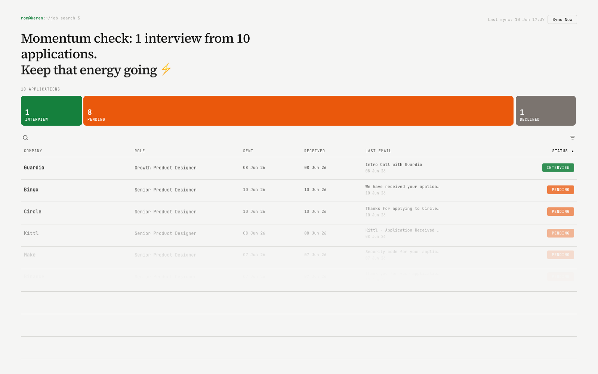

# Job Application Tracker

A local dashboard that reads your Gmail for job application emails and tracks
their status (pending, interview, declined, offer) over time.



## Setup

### 1. Install dependencies

```bash
bun install
```

### 2. Configure your name and role

```bash
bun setup.js
```

This walks you through setting your display name, terminal handle, and
default job role, and saves them to `config.json` (not committed to git).

### 3. Connect your Gmail account

The tracker reads your Gmail via the Gmail API using a read-only OAuth scope —
it never sends or modifies anything.

1. Go to the [Google Cloud Console](https://console.cloud.google.com/) and
   create a new project (or use an existing one).
2. In **APIs & Services → Library**, search for **Gmail API** and enable it.
3. In **APIs & Services → OAuth consent screen**:
   - Choose **External**.
   - Fill in the required fields (app name, your email).
   - Under **Test users**, add your own Gmail address.
4. In **APIs & Services → Credentials**, click **Create Credentials →
   OAuth client ID**.
   - Application type: **Desktop app**.
   - Download the resulting JSON file.
5. Save the downloaded file as `credentials.json` in this `tracker/`
   directory (it's gitignored — never committed).
6. Run the authorization flow:

   ```bash
   bun auth.js
   ```

   This opens your browser, asks you to log in and grant read-only Gmail
   access, and saves a `token.json` file.

### 4. Sync your applications

```bash
bun gmail_fetcher.js
```

This scans your recent Gmail for job application emails and writes
`applications.json`.

### 5. Start the dashboard

```bash
bun server.js
```

Open [http://localhost:4343](http://localhost:4343) to view your tracker.

You can re-sync anytime by clicking **Sync Now** in the dashboard, or by
running `bun gmail_fetcher.js` (or `./refresh.sh`) again.

## Dashboard features

- **Sort & search** — click any column header to sort, or use the search
  box to filter by company, role, or email content.
- **Manual status override** — change an application's status directly in
  the dashboard. Your override is remembered and won't be overwritten by
  future syncs.
- **Remove applications** — hide an entry you don't want tracked. It stays
  hidden across future syncs.
- **Reset all** — clear all manual overrides and removed entries, then
  re-scan the last 30 days of Gmail from scratch.
- **Smarter email parsing** — the sync logic recognizes more job-application
  email formats and filters out newsletters, marketing, and other non-job
  emails, so fewer "Unknown" or misclassified entries show up.
- **Improved empty/error states** — clearer messaging when you have no
  applications yet or when a sync fails.
- **Notes & AI interview prep** — expand an application to jot down prep
  notes (recruiter contacts, questions to ask, etc.) that persist across
  syncs. Interview and offer-stage applications also get copyable
  `/interview-coach` commands and a next-steps checklist — see
  [Interview prep](#interview-prep) below.

## Interview prep

For applications in the **Interview** or **Offer** stage, the expanded row
includes ready-to-paste commands for the
[interview-coach](https://github.com/noamseg/interview-coach-skill) Claude
Code skill (installed at `~/.claude/skills/interview-coach/`), e.g.:

```
/interview-coach research <Company> — <Role>
/interview-coach prep <Company> — <Role>
/interview-coach negotiate <Company> — <Role>
```

Click **Copy**, paste the command into Claude Code, and the coach will
research the company, build a tailored prep plan, or help with negotiation.

## Files

- `config.json` — your name/handle/role (generated by `bun setup.js`,
  gitignored)
- `credentials.json` — your Google OAuth client credentials (gitignored)
- `token.json` — your Gmail access/refresh token (gitignored)
- `applications.json` — synced application data (gitignored)
